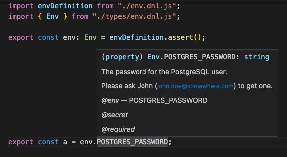

# dotenv-never-lies

> [!CAUTION]
> Experimental — not yet ready to use.

> Because environment variables lie all the time.

**dotenv-never-lies** validates, types, and documents your environment variables from a TypeScript / Zod schema.  
It fails fast, loud, and before production.

## Why?

Because all of this happens all the time:

- ❌ a missing env variable → runtime crash
- ❌ a malformed URL → subtle production bug
- ❌ CI was not updated after a new variable → confusing red deployment
- ❌ an optimistic `process.env.FOO!` → lying to yourself

And because `.env` files are:

- untyped
- undocumented
- shared manually
- rarely up to date

👉 **dotenv-never-lies** turns this fragile configuration into an explicit contract.

---

## What the library does

- ✅ validates environment variables at startup
  powered by zod, enables complex transformations (arrays, parsing, coercion…)
- ✅ provides infer .Env to get a first real life dnl schema
- ✅ provides reliable TypeScript typings
- ✅ documents each variable
- ✅ exposes a CLI for CI and humans (dnl export)

---

## What dotenv-never-lies is not

This package has a deliberately limited scope.

- ❌ **It is not a frontend tool**  
  It is not meant to be used in a browser.  
  No bundler, no `import.meta.env`, no variables exposed to the client.

- ❌ **It is not a secrets manager**  
  It does not encrypt anything, does not store anything, and does not replace Vault, AWS Secrets Manager,  
  nor your CI/CD provider’s secure variables.

- ❌ **It is not a cross-runtime solution**  
  Targeted support: **Node.js**.  
  Deno, Bun, Cloudflare Workers, edge runtimes: out of scope (for now).

- ❌ **It is not a global configuration framework**  
  It does not manage YAML/JSON files, dynamic profiles,  
  nor magical per-environment overrides.

- ❌ **It is not permissive**  
  If a variable is missing or a value is invalid, it crashes.  
  That’s the point.

In short:  
**dotenv-never-lies** is for **Node.js APIs** and **backend services**  
that prefer to **fail cleanly at startup** rather than **silently break in production**.

---

## Installation

```bash
npm install @romaintaillandier1978/dotenv-never-lies
# or
yarn add @romaintaillandier1978/dotenv-never-lies
```

## Dependencies and compatibility

**[`zod`](https://www.npmjs.com/package/zod)** — dotenv-never-lies exposes Zod schemas in its public API.

⚠️ Important: Zod **v4.2.1** minimum is required.  
Using Zod v3 will cause typing or inference errors.

**[`dotenv`](https://www.npmjs.com/package/dotenv)** allows dotenv-never-lies to automatically handle parsing of env files.

**[`dotenv-expand`](https://www.npmjs.com/package/dotenv-expand)** allows dotenv-never-lies to automatically handle environment variable expansion. This lets you define variables composed from other variables without duplication or fragile copy-paste.

**Example**

```env
FRONT_A=https://a.site.com
FRONT_B=https://b.site.com
FRONT_C=https://c.site.com

NODE_CORS_ORIGIN="${FRONT_A};${FRONT_B};${FRONT_C}"
```

## DNL schema

The DNL schema is your new source of truth.

(`dnl infer` will help you scaffold the first skeleton)

### schema location

Recommended: `env.dnl.ts`

Supported in this order for all CLI commands:

1. `--schema path/to/my-dnl.ts`
2. declared in `package.json`:

```json
{
    ...
    "dotenv-never-lies": {
        "schema": "path/to/my-dnl.ts"
    }
    ...
}
```

3. one of `env.dnl.ts`, `env.dnl.js`, `dnl.config.ts`, `dnl.config.js`

### define a schema

```typescript
import { z } from "zod";
import { define } from "@romaintaillandier1978/dotenv-never-lies";

export default define({
    NODE_ENV: {
        description: "Runtime environment",
        schema: z.enum(["test", "development", "staging", "production"]),
    },

    NODE_PORT: {
        description: "API port",
        schema: portSchema("NODE_PORT").default(3000),
    },

    FRONT_URL: {
        description: "My website",
        schema: z.url(),
    },

    JWT_SECRET: {
        description: "JWT Secret",
        schema: z.string(),
        secret: true,
    },
});
```

## Secrets handling

Reminder: dotenv-never-lies is not a secrets manager.

### declaration in the DNL schema

A variable is considered secret if and only if it is explicitly marked in the schema with `secret: true`.  
(`secret: undefined` is equivalent to `secret: false`)  
This rule is intentionally strict.

```ts
JWT_SECRET: {
    description: "JWT signing key",
    schema: z.string(),
    secret: true,
}
```

### Secrets and CLI commands

assert: validates secrets like any other variable

infer: when generating the schema, with `--guess-secret` option, the command tries to automatically identify sensitive variables (e.g. SECRET, KEY, TOKEN, PASSWORD).  
**This detection is heuristic and must always be reviewed and corrected manually.**

export: adapts behavior depending on the target format (env, docker, CI, Kubernetes…). See the table below for details by format.

### During export

Variables marked `secret: true` in the schema are treated differently depending on the export format.

| Format        | Secrets included by default | Maskable (`--hide-secret`) | Excludable (`--exclude-secret`) | Notes                      |
| ------------- | --------------------------- | -------------------------- | ------------------------------- | -------------------------- |
| env           | yes                         | yes                        | yes                             | classic .env               |
| docker-env    | yes                         | yes                        | yes                             | For --env-file             |
| docker-args   | yes                         | yes                        | yes                             | For docker run -e          |
| json          | yes                         | yes                        | yes                             | Debug / tooling            |
| ts            | yes                         | yes                        | yes                             | Typed export               |
| js            | yes                         | yes                        | yes                             | Runtime export             |
| github-env    | yes                         | yes                        | yes                             | visible in logs            |
| github-secret | secrets only                | no                         | yes                             | Via gh secret set          |
| gitlab-env    | yes                         | yes                        | yes                             | GitLab CI variables        |
| k8s-configmap | yes                         | yes                        | yes                             | warning if secret unmasked |
| k8s-secret    | secrets only                | yes                        | yes                             | Kubernetes Secret          |

## Variable lifecycle

dotenv-never-lies works with three distinct representations of environment variables:

1. **Raw value**  
   The original value coming from the source (`.env` file or `process.env`).  
   Always a string (or undefined).

2. **Runtime value (validated)**  
   The value after validation — and possible transformation — by the Zod schema.  
   This value may be strongly typed (number, boolean, array, object, etc.).

3. **Exported value**  
   The value written by `dnl export`.
    - For env-like formats (`env`, `docker-*`, `github-*`, `k8s-*`), this is the **raw value**, after validation.
    - For `js`, `ts` and `json`, the runtime value can be exported using `--serialize-typed`.

This separation ensures that validation, runtime usage and configuration export remain explicit and predictable.

## Runtime usage

```typescript
import envDef from "./env.dnl";

export const ENV = envDef.load();

// if (process.env.NODE_ENV && process.env.NODE_ENV === "test") {
if (ENV.NODE_ENV === "test") {
    doAdditionalTest();
}

const server = http.createServer(app);
//server.listen(process.env.NODE_PORT||3000, () => {
server.listen(ENV.NODE_PORT, () => {
    console.log(`Server started on ${ENV.NODE_PORT}`);
});
```

Result:

- `ENV.NODE_ENV` is an enum
- `ENV.NODE_PORT` is a number
- `FRONT_URL` is a valid URL
- `ENV.JWT_SECRET` is a string

If a variable is missing or invalid → the process exits immediately.  
This is intentional.

## Avoid `process.env` in application code

Once the schema is loaded, environment variables  
must be accessed exclusively via the `ENV` object.

This guarantees:

- strict typing
- validated values
- a single entry point for configuration

To identify residual `process.env` usages in your codebase, a simple search tool is enough:

```bash
grep -R "process\.env" src
```

Choosing to refactor (or not) those usages depends on context and is intentionally left to the developer.

## CLI

The CLI lets you validate, load, generate, export, and document environment variables from a `dotenv-never-lies` schema.

It is designed to be used:

- locally (by humans)
- in CI (without surprises)
- before the application starts (not after)

### Exit codes

`dotenv-never-lies` uses explicit exit codes, designed for CI:

| Code | Meaning                       |
| ---: | ----------------------------- |
|    0 | Success                       |
|    1 | Usage error or internal error |
|    2 | DNL schema not found          |
|    3 | Environment validation failed |
|    4 | Error during export           |

### assert: Validate a `.env` file (CI-friendly)

Validates variables without injecting them into `process.env`.

```bash
dnl assert --source .env --schema env.dnl.ts
```

Without `--source`, `dnl assert` validates `process.env`.  
This is the recommended mode when variables are injected by the runtime or CI.

→ fails if:

- a variable is missing
- a value is invalid
- the schema is not respected

### init: Generate a .env file from the schema

Initialize a documented `.env` from the schema.
Do not read any environment variables

```bash
dnl generate --schema env.dnl.ts --out .env
```

Useful for:

- bootstrapping a project
- sharing a template
- avoiding obsolete `.env.example` files

### infer: discover a .envfile, and generate a schema from an existing .env

Generate a DNL schema from an existing `.env` file.

```bash
dnl infer --source .env
```

Useful for migrating an existing project

→ [Read infer documentation](docs/commands/infer.md)

### explain: Display variables documentation

Displays the list of known variables and their description.

```bash
dnl explain
```

Sample output:

```bash
NODE_ENV: Runtime environment
NODE_PORT: API port
FRONT_URL: My website
JWT_SECRET: JWT Secret
```

### export: Export variables to other formats

The `export` command transforms variables validated by the schema  
into formats directly consumable by other tools (Docker, CI, Kubernetes, scripts…).

The schema remains the source of truth.  
Values are validated before export.

```bash
dnl export <format>
```

By default, values are read from `process.env`.  
A `.env` file can be provided via `--source`.

Examples:  
Export environment variables as JSON from a `.env` file

```bash
dnl export json --source .env
```

Clean a `.env` file (remove comments and extraneous lines)

```bash
dnl export env --source .env --out .env.clean
dnl export env --source .env --out .env --force
```

Export variables as `docker-args`

```bash
dnl export docker-args --source .env
```

Result:

```bash
-e "NODE_ENV=production" -e "NODE_PORT=3000"
```

Export for GitHub Actions (variables)

```bash
dnl export github-env
```

Result:

```bash
printf '%s\n' "NODE_ENV=production" >> $GITHUB_ENV
printf '%s\n' "NODE_PORT=3000" >> $GITHUB_ENV
```

There are a few more formats and options (see CLI docs `dnl export --help`).

## export types : Exporting TypeScript types

`dnl export types` generates a `.d.ts` file describing the **static contract** of your environment variables.

This file is intentionally **conservative**.

### Transformed variables

If a variable uses a Zod `transform`, the exported type always reflects the **input type**, not the runtime output.

In that case:

- a warning is emitted in the CLI
- the generated type is annotated with `@dnl-transform`
- the runtime value returned by `assert()` may differ

This is a deliberate design choice to avoid lying to TypeScript.

## Real-life usage

### GitIgnore

dotenv-never-lies creates temporary files in your project directory.  
Add `.dnl/` to your `.gitignore`.

### Git

#### Recommended Git hooks

Using **dotenv-never-lies** via Git hooks is strongly recommended:

- **pre-commit**: prevents committing if the local configuration is not compliant with the schema
- **post-merge**: immediately detects schema changes impacting the local environment

The goal is simple:  
**if the local configuration is not compliant with the schema, code must not be committed.**

The schema is the source of truth, not `.env` files.

These hooks help avoid classic mistakes:

- missing variable after a pull
- invalid format detected too late
- “works on my machine” due to an outdated `.env`

#### Hooks installation

```bash
git config core.hooksPath .githooks
mkdir -p .githooks

cat > .githooks/pre-commit <<'EOF'
#!/bin/sh
yarn dnl assert --source .env
EOF

cat > .githooks/post-merge <<'EOF'
#!/bin/sh
yarn dnl assert --source .env || true
EOF

chmod +x .githooks/pre-commit .githooks/post-merge
```

### GitLab CI

Environment variables validation step.

```yaml
# .gitlab-ci.yml
check-env:
    stage: test
    image: node:20-alpine
    script:
        - corepack enable
        - yarn install --frozen-lockfile
        - yarn dnl assert --source $DOT_ENV_FILE
```

### GitHub Actions

```yaml
# .github/workflows/check-env.yml
name: Check environment

on: [push, pull_request]

jobs:
    check-env:
        runs-on: ubuntu-latest
        steps:
            - uses: actions/checkout@v4

            - uses: actions/setup-node@v4
              with:
                  node-version: 20

            - run: corepack enable
            - run: yarn install --frozen-lockfile

            # Example with a .env file provided by a secret
            - run: yarn dnl assert --source .env
```

The `.env` file can be generated from a GitHub secret or mounted dynamically.

```yaml
- run: echo "$ENV_FILE_CONTENT" > .env
  env:
      ENV_FILE_CONTENT: ${{ secrets.ENV_FILE }}
```

### Which commands should I use?

|                               Situation | Command to use                 |
| --------------------------------------: | ------------------------------ |
|                             New project | generate                       |
|            Existing project with a .env | infer                          |
|            Validate configuration in CI | assert                         |
| Validate config injected by the runtime | assert                         |
|                      Document variables | explain                        |
|                   Generate a clean .env | export env                     |
|                  Prepare a Docker build | export docker-\*               |
|                  Inject variables in CI | export github-env / gitlab-env |
|         Kubernetes (ConfigMap / Secret) | export k8s-\*                  |

Simple rule:

> The schema is always the source of truth.  
> Commands only validate, document, or transform.

### Tips

**Alternative: minimal-intrusion integration**

For a minimally invasive integration, you can add an optional Yarn script
to validate your `.env` file before starting the application:

```json
{
    "scripts": {
        "env:check": "dnl assert --source .env",
        "start:withdnl": "yarn env:check && yarn start"
    }
}
```

This validates the environment before startup, without changing runtime behavior or application code.

> This is optional. It does not replace runtime validation.

**Intellisens and JSdoc for env vars**

After using `dnl export types` and importing the generated file, you get strong typing, auto-completion, IntelliSense and JSDoc for each environment variable.



> IntelliSense and JSDoc generated from the DNL schema after `dnl export types`.

## Common issues / Troubleshooting

### TypeScript projects with `rootDir: "src"`

If your project uses a strict TypeScript setup with `rootDir: "src"`,
and your `env.dnl.ts` file is located at the project root,
TypeScript may report an error like:

> File 'env.dnl.ts' is not under 'rootDir' (TS6059)

**Option A** (preferred) :

Keeps the schema outside application code, allowing reuse by the CLI, CI, and tooling.

To fix this, include `env.dnl.ts` explicitly in your `tsconfig.json` and widen `rootDir`:

```json
{
    "compilerOptions": {
        "rootDir": "."
    },
    "include": ["src/**/*.ts", "env.dnl.ts"]
}
```

This ensures `env.dnl.ts` is included in the TypeScript compilation graph.

**Option B** :

Move the schema into `./src` (for example `./src/env/env.dnl.ts`).

This avoids TypeScript configuration changes, but makes the schema part of the application codebase

You will need to specify schema location, see related section

## FAQ / Design choices

### Why so strict?

Because configuration errors are bugs, not warnings.

If a variable is missing or invalid:

- the application must not start
- the error must be immediate and explicit

Tolerating an invalid config is just moving the bug to production.

### Why Node.js only?

Because the target runtime is clear:

- APIs
- workers
- jobs
- CI

Edge runtimes (Deno, Bun, Cloudflare Workers…) have:

- different environment models
- different constraints
- different expectations

They are deliberately out of scope.

### Why Zod?

Because Zod provides:

- reliable TypeScript typing
- consistent runtime validation
- expressive transformations

The schema is both:

- documentation
- contract
- validation
- typing source

No other tool covers these four points as cleanly today.

### Why not use dotenv-safe / env-schema / others?

These tools:

- partially validate
- provide little or weak typing
- do not really document
- do not offer a coherent CLI

dotenv-never-lies assumes a stricter scope,  
but provides a full chain:  
schema → validation → typing → CI → export.

### Why not manage secrets?

Because it is not the right level.

dotenv-never-lies:

- identifies secrets
- can exclude, mask, or export them

But it:

- encrypts nothing
- stores nothing

It integrates with existing tools; it does not compete with them.

# Conclusion:

> dotenv-never-lies does not aim to be flexible. It aims to be reliable, explicit, and predictable.
