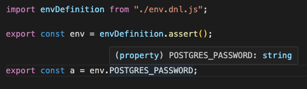

# dnl types

The `dnl types` command generates a TypeScript declaration file (`.d.ts`) from an existing DNL schema (`env.dnl.ts`).

This file is not used at runtime.
It is intended exclusively for the IDE to provide:

- auto-completion
- hover documentation
- a clear static contract of environment variables

**This step is entirely optional.**

`dnl types` is not required for DNL to work.
It only serves to improve the developer experience in the IDE.

> 👉 ... but here begins the Real Black Magic. 😈

⸻

## Objective

Once a DNL schema is written and documented, the objective of `dnl types` is to:

- project this schema into a TypeScript contract readable by the IDE
- without re-reading values
- without redoing inference
- without manually duplicating types

The result is an `env.dnl.d.ts` file that describes the static contract of the environment, as it is actually validated at runtime by DNL.

⸻

## Positioning

### What `dnl types` does

`dnl types`:

- reads only the DNL schema (`env.dnl.ts`)
- uses TypeScript's real inference on the schema (via `ReturnType`)
- generates a `.d.ts` file containing:
- documented properties (JSDoc)
- types strictly aligned with the runtime
- improves developer experience in the IDE (IntelliSense)

This is a static projection, not a dynamic analysis.

⸻

### What `dnl types` does NOT do

This is intentional.

`dnl types`:

- ❌ does not read any `.env` file
- ❌ does not read `process.env`
- ❌ does not validate any values
- ❌ does not redo any inference
- ❌ does not apply any transformation
- ❌ is not used at runtime

The generated file:

- is never executed
- is never imported in production
- exists only for the IDE and the TypeScript compiler

⸻

## Why a `.d.ts`?

TypeScript does not allow dynamically associating documentation (JSDoc) with computed or inferred types.

However, a DNL schema produces precisely this type of structure:

- inferred types
- transformations
- complex unions
- validated runtime values

To provide rich and reliable IntelliSense, DNL therefore generates:

- an explicit declaration file
- containing real TypeScript symbols
- on which documentation can be properly attached

This file acts as an official bridge between:

- the runtime (DNL + Zod)
- TypeScript inference
- the IDE

⸻

## When to use `dnl types`

Recommended:

`dnl types` is a **voluntary** step.

- once the `env.dnl.ts` schema is completed and reviewed after:
    - correcting types
    - adding descriptions
    - marking secrets
    - defining business constraints
- when you want:
    - reliable IntelliSense
    - an environment contract readable by the entire team
- when the DNL schema has been modified (addition, removal, modification of variables)
    - to update the type

⸻

## When NOT to use `dnl types`

Not necessary:

- during the initial inference phase
- as long as the schema still contains `TODO`s
- if the schema is still evolving significantly

⸻

## General operation

1. DNL loads the `env.dnl.ts` schema
2. TypeScript infers the real type returned by `assert()`
3. `dnl types` generates a documented interface
4. Each property:

- references exactly the inferred type
- exposes the documentation written in the schema

5. The `.d.ts` file is written to disk

No application logic is executed.

## CLI – usage

```bash
dnl types
```

By default:

- source schema: `./env.dnl.ts`
- output: `./src/types/env.dnl.d.ts`

⸻

### Generate for a specific file

```bash
dnl --schema ./path/to/my-dnl.ts types
```

### Generate to a specific file

```bash
dnl types --out ./src/types/env.dnl.d.ts
```

### Force overwrite

```bash
dnl types --out ./src/types/env.dnl.d.ts --force
```

## Generated file structure

The generated file contains:

- an import of the compiled schema (`env.dnl.js`)
- an internal type representing the real runtime environment
- an exported documented interface (`ENV`)

Simplified example:

```typescript
import envDefinition from "../env.dnl.js";
type RuntimeEnv = ReturnType<typeof envDefinition.assert>;
export interface Env {
    /**
     * Node.js runtime environment
     * @env NODE_ENV
     */
    NODE_ENV?: RuntimeEnv["NODE_ENV"];
    /**
     * The username for the PostgreSQL user. It SHOULD have Admin role !

Please ask John (john.doe@somewhere.com) to get one.
     * @env POSTGRES_USER
     * @required
     */
    POSTGRES_USER: RuntimeEnv["POSTGRES_USER"];
    /**
     * The password for the PostgreSQL user.

Please ask John (john.doe@somewhere.com) to get one.
     * @env POSTGRES_PASSWORD
     * @secret
     * @required
     */
    POSTGRES_PASSWORD: RuntimeEnv["POSTGRES_PASSWORD"];
}
```

This interface is then used exclusively by the IDE.

👉 Without dnl types (no enriched IntelliSense):



👉 With dnl types (IntelliSense + documentation)


⸻

## Relationship with `dnl infer`

The two commands are complementary, but clearly separated:

`dnl infer`:

- creates an initial schema
- applies heuristics
- requires human review

`dnl types`:

- does not perform any inference
- does not modify the schema
- projects a stabilized schema to the IDE

Recommended flow:

1. `dnl infer`
2. manual schema editing
3. `dnl types`

⸻

## Summary

- `dnl types` does not perform magic at runtime
- it leverages TypeScript's real capabilities
- it generates an IDE-only artifact
- it guarantees:
- exact types
- visible documentation
- reliable IntelliSense

The magic is black,
but it is deterministic, traceable, and intentional.
